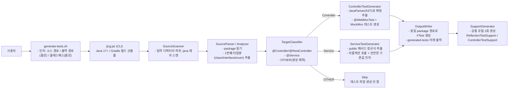
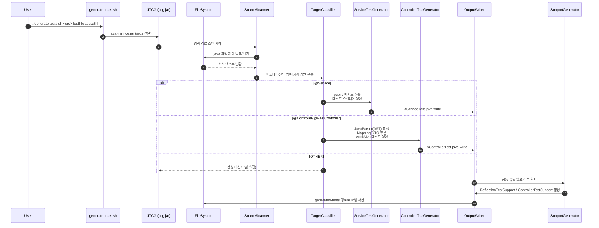
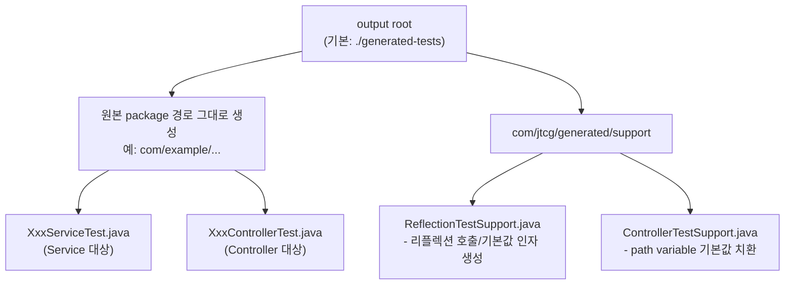
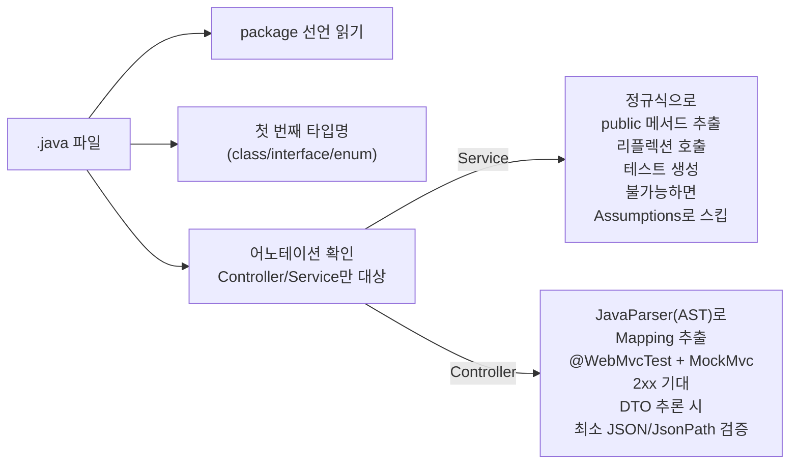

# JTCG (JUnit Test Code Generator)

절대 경로(디렉터리)를 입력으로 받아, 해당 위치의 모든 하위 `.java` 파일을 재귀적으로 스캔한 뒤 **JUnit5 테스트 코드 스켈레톤**을 생성하는 간단한 CLI 도구입니다.

* 스프링부트 사용 없음
* 순수 Java 코드 기반
* 편하게 쓰도록 실행 스크립트 포함

## 전체 구조 다이어그램 (CLI → 스캔 → 분류 → 생성 → 출력)


## 동작 시퀀스 (실행부터 파일 생성까지)


## 생성 산출물(폴더/파일) 구조 다이어그램


## 생성 규칙 요약을 구조에 “정확히” 매핑한 미니 다이어그램


## 요구 사항

* Java 17+
* Gradle 8+ (또는 Gradle Wrapper `./gradlew`)

## 빠른 시작

처음 한 번 실행 권한을 부여하세요:

```bash
chmod +x ./generate-tests.sh
```

### 1) 빌드

```bash
./gradlew -q clean jar
```

빌드 결과물은 `build/libs/jtcg.jar` 입니다.

### 2) 테스트 생성

```bash
./generate-tests.sh /absolute/path/to/your/java/sources
```

기본 출력 위치는 `./generated-tests` 입니다.

출력 위치를 지정하려면:

```bash
./generate-tests.sh /absolute/path/to/your/java/sources /absolute/path/to/output
```

대상 프로젝트를 이미 빌드해두었다면(선택), 클래스패스를 함께 넘겨 **요청/응답 DTO 추론 정확도**를 높일 수 있습니다:

```bash
./generate-tests.sh /absolute/path/to/your/java/sources /absolute/path/to/output \
  "/abs/project/build/classes/java/main:/abs/project/build/resources/main:/abs/project/build/libs/*"
```

## 생성 규칙(현재 버전)

* 입력 디렉터리 하위의 모든 `.java` 파일을 스캔하지만, **테스트 생성 대상은 아래 2종류로 제한**
  * `@Controller` / `@RestController`
  * `@Service`
* 그 외 일반 클래스(OTHER)는 스캔되더라도 테스트를 생성하지 않음
* 파일의 `package` 선언을 읽어 동일한 패키지 경로로 테스트 파일을 생성
* 첫 번째로 발견되는 `class`/`interface`/`enum` 타입명을 기준으로 `XTest` 파일 생성
* `@Service`:
  * `public` 메서드를 단순 정규식으로 추출하여 `@Test` 메서드를 생성
  * 각 테스트는 리플렉션으로 해당 메서드를 찾은 뒤, 파라미터 타입에 따라 "안전한 기본값"을 만들어 호출합니다.
    (예: primitive=0/false, `String`="", `Optional`=`Optional.empty()`, `List`=`List.of()` 등)
  * 호출에 필요한 인자 생성이 불가능하거나, 대상 타입에 기본 생성자(무인자 생성자)가 없어 인스턴스 생성이 불가능하면
    해당 테스트는 실패 대신 `Assumptions`로 스킵합니다(불안정 테스트 방지)
  * 예외가 발생하지 않는지(`assertDoesNotThrow`)를 검증하고, 반환 타입이 객체면 `assertNotNull`을 추가합니다.
* `@Controller` / `@RestController`:
  * 소스를 AST(JavaParser)로 파싱해 매핑 어노테이션(`@GetMapping`, `@PostMapping`, `@RequestMapping` 등)과 경로/HTTP 메서드를 추출
  * 추출된 엔드포인트에 대해 스프링부트 `@WebMvcTest` 기반으로 `MockMvc` 요청을 수행하고 `2xx` 응답을 기대
  * 컨트롤러의 `private final` 필드(또는 `@Autowired` 필드)에서 의존 타입을 매우 단순하게 추출해 `@MockBean`으로 선언합니다.
  * 경로에 `{id}` 같은 path variable이 있으면 기본값으로 치환하여 요청합니다(예: `/items/{id}` → `/items/1`)
  * `POST`/`PUT`/`PATCH`는 기본으로 JSON `contentType`/`accept`을 설정하고,
    `@RequestBody` 파라미터 타입이 소스에서 추론 가능하면 DTO 필드를 전수 스캔해 간단한 샘플 JSON 바디를 생성합니다(추론 불가 시 `{}`).
  * 응답 타입이 DTO로 추론 가능하면 `contentTypeCompatibleWith(JSON)` + `jsonPath(...).exists()` 형태로 **최소 구조 검증**을 자동 추가합니다.
  * (참고) `@WebMvcTest`는 컨텍스트 기동을 위해 의존 빈 mocking이 필요합니다. 이 도구는 "추정"으로 `@MockBean`을 생성하므로,
    실제 프로젝트 구조에 따라 추가/수정이 필요할 수 있습니다.

### 공통 유틸(중복 제거)

생성되는 테스트 파일들에서 반복되던 헬퍼 코드는 출력 루트에 공통 유틸로 1회 생성됩니다:

* `com/jtcg/generated/support/ReflectionTestSupport.java`
  * Service 테스트의 리플렉션 호출/기본값 인자 생성
* `com/jtcg/generated/support/ControllerTestSupport.java`
  * path variable 기본값 치환

> 주의: Java 문법 전체를 파싱하는 AST 기반이 아니라, 현재는 단순한 텍스트 기반 파싱입니다.
> 복잡한 제네릭/중첩 타입/여러 타입이 한 파일에 있는 경우 등은 완벽히 처리하지 못할 수 있습니다.

## 예시 출력

### Service 예시

`@Service`인 `com.example.FooService`가 있으면 다음과 같은 형태가 생성됩니다:

```java
package com.example;

import com.jtcg.generated.support.ReflectionTestSupport;

import org.junit.jupiter.api.Assumptions;
import org.junit.jupiter.api.Test;

import java.lang.reflect.Method;

import static org.junit.jupiter.api.Assertions.assertDoesNotThrow;
import static org.junit.jupiter.api.Assertions.assertNotNull;

class FooServiceTest {

    @Test
    void test_bar__0params() throws Exception {
        Method method = ReflectionTestSupport.findMethod(FooService.class, "bar", 0);
        Assumptions.assumeTrue(method != null, "Method not found by reflection: bar");

        Object target = ReflectionTestSupport.targetOrNullFor(method, FooService.class);
        if (!java.lang.reflect.Modifier.isStatic(method.getModifiers())) {
            Assumptions.assumeTrue(target != null, "No default constructor: FooService");
        }

        Object result = assertDoesNotThrow(() -> ReflectionTestSupport.invokeWithDefaults(method, target));
        if (method.getReturnType() != void.class && !method.getReturnType().isPrimitive()) {
            assertNotNull(result);
        }
    }
}
```

### Controller 예시

`@RestController`인 `com.example.HelloController`가 있고 `@GetMapping("/hello")`가 있으면 다음과 같은 형태가 생성됩니다:

```java
package com.example;

import com.jtcg.generated.support.ControllerTestSupport;

import org.junit.jupiter.api.Test;

import org.springframework.beans.factory.annotation.Autowired;
import org.springframework.boot.test.autoconfigure.web.servlet.AutoConfigureMockMvc;
import org.springframework.boot.test.autoconfigure.web.servlet.WebMvcTest;
import org.springframework.boot.test.mock.mockito.MockBean;
import org.springframework.http.MediaType;
import org.springframework.test.web.servlet.MockMvc;
import org.springframework.test.web.servlet.request.MockHttpServletRequestBuilder;
import org.springframework.test.web.servlet.request.MockMvcRequestBuilders;

import static org.springframework.test.web.servlet.result.MockMvcResultMatchers.status;

@WebMvcTest(controllers = HelloController.class)
@AutoConfigureMockMvc(addFilters = false)
class HelloControllerTest {

    @Autowired
    private MockMvc mvc;

    @MockBean
    private FooService fooService;

    @Test
    void api_hello__0params__GET() throws Exception {
        String path = ControllerTestSupport.fillPathVariables("/hello");
        MockHttpServletRequestBuilder req = MockMvcRequestBuilders.get(path)
                .accept(MediaType.APPLICATION_JSON);
        mvc.perform(req)
                .andExpect(status().is2xxSuccessful());
    }
}
```

## CLI 직접 실행

```bash
java -jar build/libs/jtcg.jar --input /abs/path --output /abs/out
```

옵션:

* `--input` (필수): 절대 경로 디렉터리
* `--output` (선택): 생성 파일 루트 디렉터리 (기본값: `./generated-tests`)
* `--overwrite` (선택): 기존 파일이 있으면 덮어쓰기
* `--classpath` (선택): 대상 프로젝트의 클래스패스(정확도 향상용)
